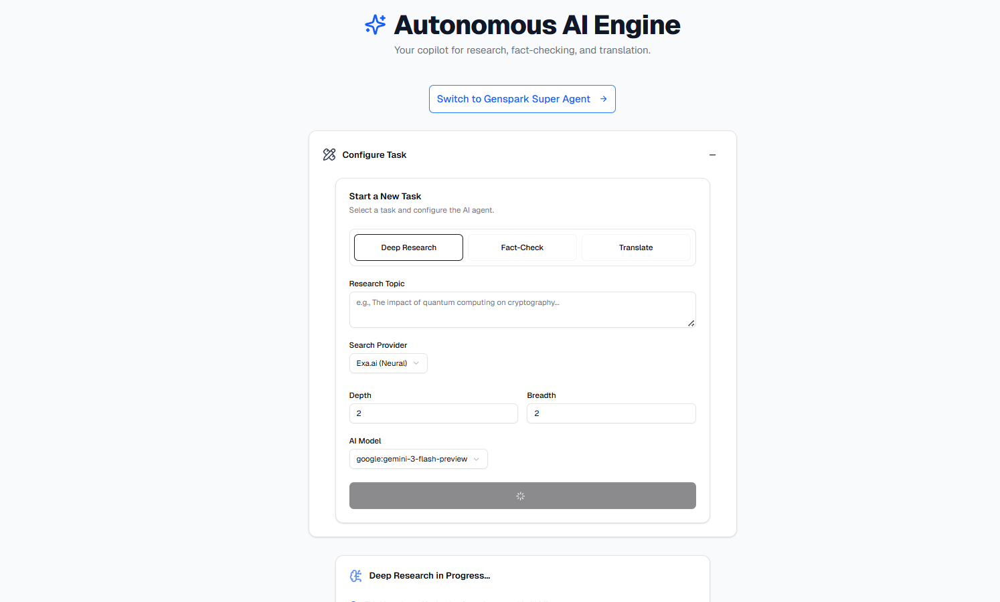
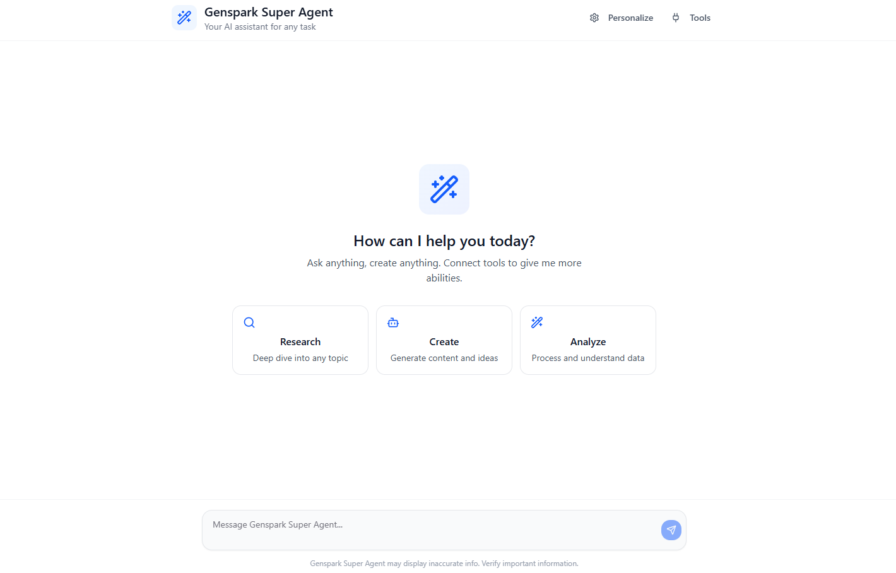

# Deep Research POC

An AI-powered research and productivity platform built on Next.js 15 with a multi-agent architecture. Three core research workflows plus a SuperAgent for natural-language app control — all running on Google Gemini 3.x models via the Vercel AI SDK.

---

## What This Project Provides

A single platform that covers the full research and productivity loop:

| Capability | What you get |
|---|---|
| **Deep Research** | Ask any question — get a structured, cited report generated by a recursive multi-agent pipeline that searches, reads, and synthesises the web |
| **Fact-Check** | Paste any claim — get a TRUE / FALSE / UNVERIFIED verdict backed by real web evidence and confidence scoring |
| **Translation** | Translate text between 20+ languages with a clean two-panel UI, language swap, and one-click copy |
| **SuperAgent** | A natural-language interface for your connected apps (Gmail, Notion, GitHub, Slack and more) — describe what you want, the agent plans and executes it |

All four features share the same Gemini 3.x model stack and are accessible from one UI with zero context-switching.



---

## Features

### 1. Deep Research

A fully multi-agentic recursive research pipeline that turns a single question into a comprehensive, cited report.

**Pipeline:**
```
User Query
  └─ SubQueryGenerator       → breaks query into N parallel sub-questions
       └─ QueryRefiner        → sharpens each sub-question for search
            └─ SearchOrchestrator (Exa / Google CSE)
                 └─ ContentFetcher     → fetches & parses HTML / PDF
                      └─ LearningExtractor  → distills key facts per source
                           └─ [recurse depth-1, breadth/2]
                                └─ ReportGenerator  → final Markdown report with citations
```

- Recursive depth + variable breadth — the agent spawns child branches on gaps it detects
- LRU-cached search results (1 h TTL) — identical sub-queries never hit the API twice
- Sub-query deduplication (normalized) — near-duplicate LLM-generated queries are collapsed
- All result evaluations run in parallel (`Promise.allSettled`) — ~5× faster per depth level
- Real token usage tracked and emitted in the final SSE `done` event
- 5-minute `AbortController` timeout on the SSE stream — no indefinitely hanging requests

---

### 2. Fact-Check

Deconstructs a claim into targeted search queries, retrieves evidence from the web, and renders a verdict with confidence scoring.

**Pipeline:**
```
Claim
  └─ ClaimDeconstructor   → 3 targeted search queries
       └─ SearchOrchestrator (Exa / Google CSE)
            └─ ContentFetcher + LearningExtractor
                 └─ SynthesisAndVerdict  → TRUE / FALSE / UNVERIFIED + reasoning
```

---

### 3. Translation

LLM-powered translation with a Google Translate-style two-panel UI.

- Source (35%) / Target (65%) split layout — translated text is the visual focal point
- 20 preset languages + custom language input for both source and target
- Language swap button
- One-click copy with 2-second "Copied ✓" feedback
- Character counts on both panels
- Powered by `gemini-3.1-flash-lite-preview` by default (configurable)

---

### Why Exa for Web Retrieval

All three research workflows use **Exa** as the primary search provider (Google CSE as fallback).

| | Exa | Google CSE |
|---|---|---|
| **Query type** | Meaning-based neural search | Keyword index |
| **Result quality** | Returns semantically relevant full-content pages | Returns blue-links, often SEO noise |
| **Direct content access** | Returns page contents directly in the API response | Requires a separate fetch per URL |
| **Research suitability** | Purpose-built for LLM pipelines | General-purpose |
| **Structured data** | Highlights, summaries, authors, published dates | Snippets only |

Exa's neural retrieval means the `LearningExtractor` agent receives genuinely relevant content rather than having to filter keyword-stuffed pages — reducing hallucination risk and improving citation quality at every depth level.

---

## SuperAgent

> A separate, standalone feature — independent of the three research workflows above.



SuperAgent is a **natural-language interface for your connected apps**. Instead of opening Gmail, switching to Calendar, then navigating to Notion — you describe what you want and the agent figures out which tools to call, in which order, and executes them.

```
User message (natural language)
  └─ LLM Router        → classifies intent, scores confidence, plans execution steps
       └─ Pinecone      → semantic tool search (finds relevant Composio actions)
            └─ Composio  → executes the matched tool against the connected app
                 └─ Redis → conversation history (10-turn sliding window, 5 min TTL)
```

**App integrations are provided through Composio's MCP tool registry** — a pre-built catalogue of thousands of actions across community apps. No custom integration code is needed; connecting a new app is an OAuth flow and its full action set is immediately available to the agent.

**Supported apps (built-in tool registry):**

| App | Capability |
|---|---|
| Gmail | Read, send, search emails |
| Google Calendar | Create events, check schedule |
| Google Drive | Access, upload, share files |
| Google Docs | Read and edit documents |
| Google Sheets | Read and write spreadsheet data |
| Notion | Read and write pages and databases |
| Slack | Send messages, read channels |
| GitHub | Manage repos, issues, PRs |
| Linear | Create and update issues |
| HubSpot | CRM contacts and deals |
| Trello | Manage boards and cards |
| Asana | Tasks and projects |
| + more | Via Composio tool registry |

**Key properties:**
- **Multi-step planning** — the agent decomposes complex requests into ordered steps with dependency resolution
- **Sequential vs parallel execution** — steps that depend on each other run in order; independent steps run concurrently
- **Up to 8 agent steps** per turn (`stopWhen: stepCountIs(8)`)
- **Conversation memory** — Redis-backed 10-turn history per session
- **No hardcoded tool list** — tools are retrieved semantically from Pinecone at runtime, so adding a new Composio integration requires zero code changes

### Dynamic Tool Search & Loading

The agent never has a fixed list of tools compiled into it. Instead, at every turn it discovers which tools to use through a three-phase pipeline:

```
1. INGEST  (one-time, per app)
   POST /api/agent/tools/ingest { appName: "GMAIL" }
     └─ Composio SDK  → fetches every action for the app (name + description)
          └─ OpenAI text-embedding-3-small → embeds each action description
               └─ Pinecone upsert (namespace = appName, batch size 100)
                    → each vector stored with { toolName, appKey } metadata

2. SEARCH  (every agent turn, real-time)
   POST /api/agent/tools/search { appName, userQuery, topK? }
     └─ embed(userQuery)  → same OpenAI embedding model
          └─ Pinecone ANN query (cosine, namespace = appName, topK = 3)
               └─ returns top-K tool *names* ranked by semantic similarity

3. EXECUTE  (agent reasoning loop)
   POST /api/agent/chat
     └─ Pinecone search → ["GMAIL_SEND_EMAIL", "GMAIL_CREATE_DRAFT", ...]
          └─ Composio.getTools(toolNames) → full OpenAI-schema tool definitions
               └─ injected into generateText({ tools }) at call time
                    └─ agent calls only the tools that matched the query
```

**Why this matters:**
- Tool definitions are only loaded when semantically relevant — the LLM context window never fills up with irrelevant schemas
- Adding a new app integration is a single `POST /api/agent/tools/ingest` call — no code changes, no redeploy
- Each app's tools are stored in their own Pinecone namespace — search is scoped and fast regardless of total registry size
- `topK` is tunable per request; defaults to 3 to keep the injected tool list minimal

---

## Tech Stack

| Layer | Technology |
|---|---|
| Framework | Next.js 15 (App Router, Turbopack) |
| LLM | Google Gemini via `@ai-sdk/google` v3 |
| AI SDK | Vercel AI SDK v6 (`ai`, `@ai-sdk/react`) |
| Models | `gemini-3-flash-preview`, `gemini-3.1-flash-lite-preview` |
| Search | Exa (`exa-js`), Google Custom Search API |
| Vector store | Pinecone |
| App integrations | Composio (`composio-core`) |
| Conversation cache | Redis (`ioredis`) |
| UI | React 19, Tailwind CSS v4, shadcn/ui |
| Streaming | Server-Sent Events (SSE) |

---

## Getting Started

### Prerequisites

- Node.js 20+
- A Google AI Studio API key (Gemini)
- Exa API key (for neural web search)
- Pinecone account + index (for SuperAgent tool search)
- Redis instance (for SuperAgent conversation history)
- Composio API key (for SuperAgent app integrations)
- Google Custom Search API key + CX (optional fallback)

### Installation

```bash
npm install
```

### Environment Variables

Create a `.env.local` file:

```env
# Google Gemini (required for all LLM calls)
GOOGLE_API_KEY=

# Web search
EXA_API_KEY=
GOOGLE_SEARCH_API_KEY=
GOOGLE_SEARCH_CX=

# SuperAgent — vector store
PINECONE_API_KEY=
PINECONE_INDEX_NAME=

# SuperAgent — conversation cache
REDIS_URL=

# SuperAgent — app integrations
COMPOSIO_API_KEY=
```

### Run

```bash
npm run dev
```

Open [http://localhost:3000](http://localhost:3000).

SuperAgent is at [http://localhost:3000/agent](http://localhost:3000/agent).

---

## Project Structure

```
src/
├── app/
│   ├── page.tsx                  # Main research UI (Deep Research / Fact-Check / Translate)
│   ├── agent/page.tsx            # SuperAgent chat UI
│   └── api/
│       ├── research/route.ts     # SSE stream endpoint for research + fact-check
│       ├── translate/route.ts    # Translation endpoint
│       └── agent/
│           ├── chat/route.ts     # SuperAgent multi-step reasoning loop
│           ├── connect/          # Composio OAuth flow
│           ├── tools/            # Tool registry (list, ingest, search)
│           └── route-apps/       # Connected apps management
├── lib/
│   ├── orchestrator.ts           # Research + fact-check workflow runner
│   ├── models.ts                 # Gemini model provider factory
│   ├── agents/                   # Individual agent functions
│   │   ├── subQueryGenerator.ts
│   │   ├── queryRefiner.ts
│   │   ├── searchOrchestrator.ts # Exa + Google CSE with LRU cache
│   │   ├── contentFetcher.ts     # HTML + PDF content extraction
│   │   ├── learningExtractor.ts
│   │   ├── reportGenerator.ts
│   │   ├── claimDeconstructor.ts
│   │   ├── synthesisAndVerdict.ts
│   │   └── translationAgent.ts
│   └── agent-backend/
│       └── composioService.ts    # Composio tool execution + OAuth
├── components/
│   ├── ResearchForm.tsx          # Task selector + language pickers
│   ├── ReportDisplay.tsx         # Markdown report renderer
│   ├── FactCheckDisplay.tsx      # Verdict + evidence display
│   ├── TranslationDisplay.tsx    # Two-panel translation UI
│   └── agent/                   # SuperAgent UI components
└── data/
    └── available_tools.ts        # Static Composio tool registry (client-safe)
```
